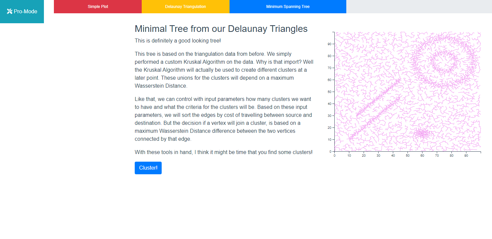
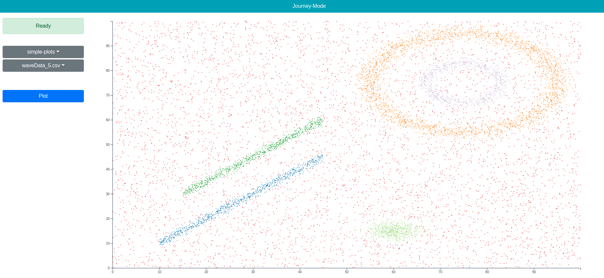
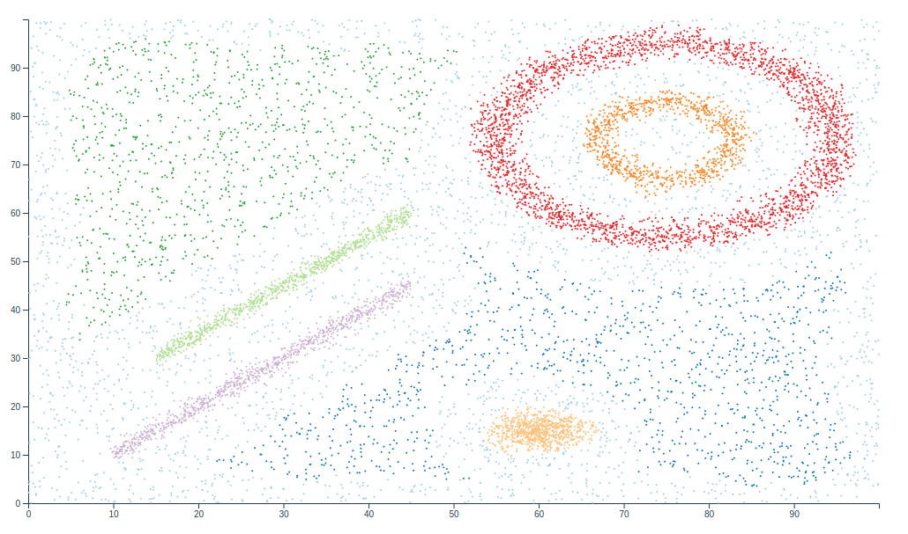
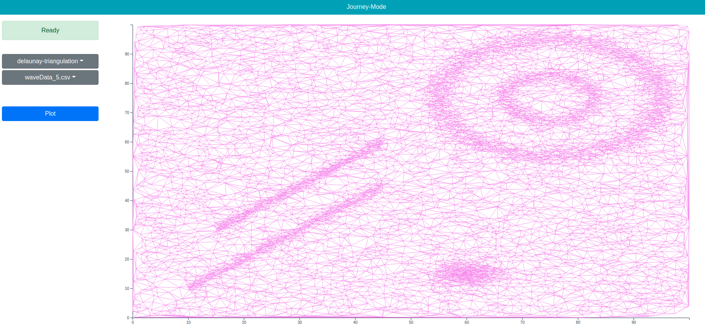
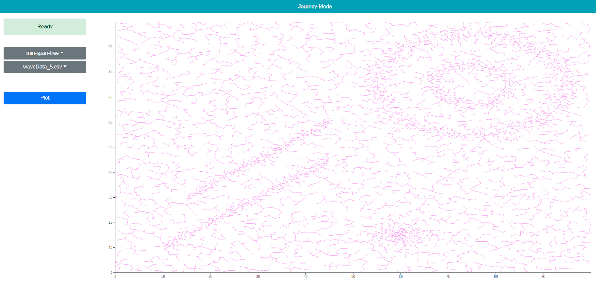
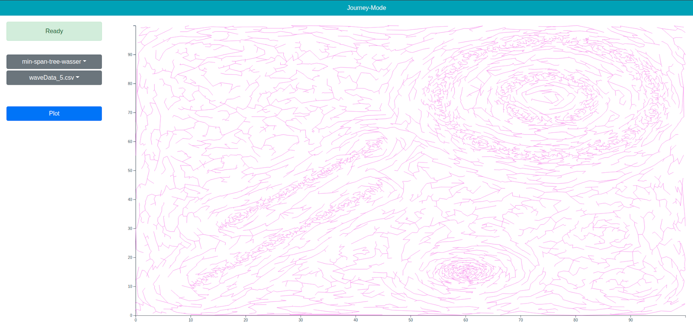
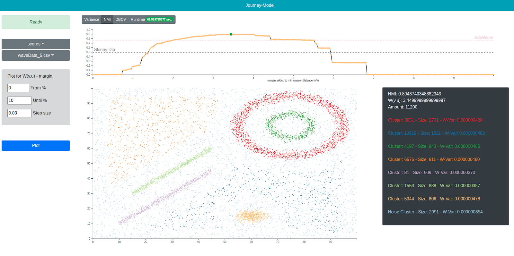

# clusterization-ui



## Quickstart

Please clone the Debian/Ubuntu setup guide.
https://github.com/barblin/clusterizer-setup-debian-ubuntu

Currently, only supported for Debian/Ubuntu.

## Project description
This UI is being developed to serve different views on point data retrieved from a backend service 
(https://github.com/barblin/clusterization-service)

A user is able to select a file from a repository, and a set of views to produce individual representations of the point data.

As of now just local startup is possible. So get the service first https://github.com/barblin/clusterization-service.
Make it run
Start frontend, ready to go

### Currently supported views
* Simple plot of point data and color labels
  
* Simple plot of data being clustered by the current wasserstein distance calculation https://github.com/barblin/clus-wasser
  
  NMI: 0.8599988147219229
* Line plot of delaunay triangulation data
  
* Line plot of minimum spanning tree produced from the delaunay triangulation graph
  
* Line plot of minimum spanning tree based on the Wasserstein distance
  
* Range plot, to generate clusters for different values between a given range
  

## Project setup
```
yarn install
```

### Compiles and hot-reloads for development
```
yarn serve
```

### Compiles and minifies for production
```
yarn build
```

### Lints and fixes files
```
yarn lint
```

### Customize configuration
See [Configuration Reference](https://cli.vuejs.org/config/).
